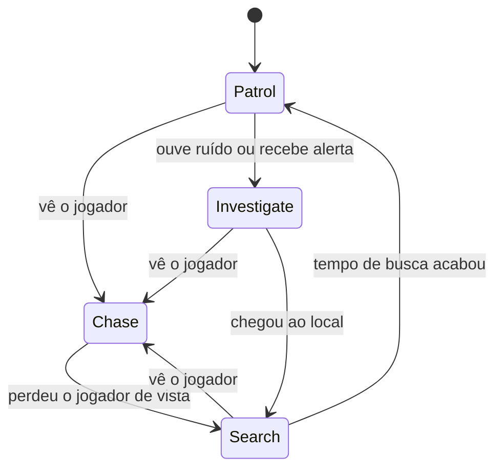

# Jogo com IA e Animator — Unity

Jogo em Unity com um **inimigo (zumbi)** controlado por uma **máquina de estados** com NavMesh e animações do **Mixamo**. O zumbi patrulha entre pontos, persegue o jogador (um rato) quando o vê, procura quando o perde de vista e ataca quando chega perto.

**Autores:** Pedro Afonso Dias Raposo e João Pedro Cordeiro Nascimento de Oliveira

---

> **Onde está a entrega:** a IA do inimigo com o Animator está na **Fase 2**, cena `Assets/Scenes/Inimigos.unity`. Para testar, abra essa cena e aperte Play, ou jogue desde o menu: vença o labirinto (Fase 1) e pise no tapete final, que leva à Fase 2.

## Requisitos da entrega

| Requisito | Situação | Onde |
|---|---|---|
| Animator configurado | Feito | `EnemyController` (Blend Tree + estado de ataque) |
| IA com Patrol entre pontos | Feito | `PatrolState`, `EnemyMovement` |
| Chase ao detectar o jogador | Feito | `EnemySensor`, `ChaseState` |
| Animações do Mixamo integradas | Feito | Idle, Walking, Run e ataque no Animator |

---

## Como abrir

1. Clone o repositório.
2. Abra a pasta no **Unity Hub** (Unity 6).
3. Abra a cena da **Fase 2** (`Assets/Scenes/Inimigos.unity`), onde está a IA do inimigo.
4. Aperte **Play**.

---

## Como funciona

### Máquina de estados do inimigo

| Estado | Comportamento | Animação |
|---|---|---|
| **Patrol** | Anda entre os pontos de patrulha em loop (P1 → P2 → P3 → P4 → P1) | Walk |
| **Chase** | Persegue o jogador em velocidade maior | Run |
| **Search** | Vai ao último local onde viu o jogador, espera alguns segundos e volta a patrulhar | Walk / Idle |
| **Investigate** | Vai ao local de um ruído ou alerta de outro inimigo | Walk |
| **Wander** | Alternativa ao Patrol: anda por pontos aleatórios do NavMesh (quando `isPatroller` está desmarcado) | Walk |

### Detecção do jogador

O `EnemySensor` considera que viu o jogador quando:

1. ele está a até **12 m** (`viewDistance`);
2. está dentro do **cone de visão de 90°** (`viewAngle`), medido no plano horizontal;
3. **não há parede** entre os dois (`Linecast` com a layer `Obstacle`).

Selecione o inimigo na Scene com **Gizmos** ligado para ver o cone.

### Ataque

O script `Attack` espera o jogador ficar dentro do alcance por **0,5 s**. Então o inimigo para, olha para o jogador e dispara o trigger `Attack` do Animator. O dano só é aplicado entre os **Animation Events** `AttackStart` e `AttackEnd`, por uma esfera (`OverlapSphere`) posicionada na mão do inimigo (`AttackPoint`). Cada golpe causa dano uma única vez.

---

## Scripts

Todos estão em `Assets/Scripts/Enemy/`.

### Núcleo da IA

| Script | Função |
|---|---|
| `EnemyBrain` | Cérebro do inimigo. Guarda o estado atual, troca de estado (`ChangeState`), guarda a última posição conhecida do jogador, recebe ruídos e alertas e atualiza o parâmetro `Speed` do Animator |
| `IEnemyState` | Interface dos estados (`Enter`, `Update`, `Exit`) |
| `PatrolState` | Patrulha entre os pontos. Passa para Chase, Investigate ou segue o próximo ponto |
| `ChaseState` | Persegue o jogador. Se perde a visão, passa para Search |
| `SearchState` | Vai ao último local conhecido, espera `searchTime` (5 s) e volta a Patrol ou Wander |
| `InvestigateState` | Vai até a posição de um ruído ou alerta e depois procura |
| `WanderState` | Anda por pontos aleatórios do NavMesh |

### Sistemas de apoio

| Script | Função |
|---|---|
| `EnemySensor` | Visão: distância, ângulo e obstáculos. Também desenha o cone nos Gizmos |
| `EnemyMovement` | Controla o `NavMeshAgent`: velocidade de patrulha (`1.5`) e de perseguição (`4`), pontos de patrulha, chegada ao destino. Não move o inimigo durante o ataque |
| `EnemyAnimator` | Envia `Speed` (float) e `Alert` (bool) ao Animator |
| `EnemyCommunication` | Quando um inimigo vê o jogador, avisa os outros num raio de 15 m |
| `NoiseSystem` | Sistema estático que emite um ruído e avisa os inimigos próximos |
| `PlayerNoise` | O jogador emite ruído (ex.: ao correr) e atrai os inimigos |

### Combate

| Script | Função |
|---|---|
| `Attack` | Ataque do inimigo (espera 0,5 s, para, olha, toca a animação e aplica dano pela janela de Animation Events) |
| `PlayerHealth` | Vida do jogador. Recebe o dano pelo método `TakeDamage` |

### Menu e fases

| Script | Função |
|---|---|
| `MenuManager` | Botões do menu: iniciar jogo e sair |
| `LevelEnd` | Colocado no tapete do fim do labirinto: ao pisar nele, carrega a Fase 2 (`Inimigos`) |

---

## Animator

**Controller:** `EnemyController`

| Parâmetro | Tipo | Uso |
|---|---|---|
| `Speed` | Float | Velocidade do `NavMeshAgent`. Controla o Blend Tree |
| `Alert` | Bool | Liga em Chase e Search, desliga em Patrol, Wander e Investigate |
| `Attack` | Trigger | Dispara o ataque |

**Estados**

- **Blend Tree (1D, parâmetro `Speed`):** Idle (0), Walking (1.5) e Run (4). A transição acontece de forma contínua conforme a velocidade do inimigo.
- **Attack:** animação de ataque (Mixamo), sem loop.
  - Blend Tree → Attack: condição `Attack`, sem Exit Time.
  - Attack → Blend Tree: com Exit Time.

**Animation Events no clipe de ataque**

- `AttackStart`: abre a janela de dano.
- `AttackEnd`: fecha a janela e libera o inimigo para se mover.

Todas as animações vêm do **Mixamo** (Idle, Walking, Run e o ataque). Foram importadas sem o modelo (*Without Skin*) e *In Place*, com **Apply Root Motion desmarcado**.

---

## Configuração do inimigo na Unity

**Componentes no objeto do inimigo:** `Animator`, `NavMeshAgent`, `Capsule Collider`, `EnemyBrain`, `EnemyMovement`, `EnemySensor`, `EnemyAnimator`, `EnemyCommunication` e `Attack`.

| Componente | Configuração principal |
|---|---|
| `EnemySensor` | `Eye Point` na altura da cabeça, `Obstacle Mask` somente com a layer `Obstacle`, `Target Height` 0 |
| `EnemyMovement` | `Patrol Points` com P1 a P4, em ordem |
| `EnemyCommunication` | `Enemy Layer` = `Enemy` |
| `Attack` | `Attack Point` na mão do inimigo (`mixamorig1:RightHand`), `Time To Attack` 0.5 |
| `NavMeshAgent` | `Stopping Distance` ajustada para o inimigo parar perto do jogador |

**Layers e tags**

- Layer `Enemy`: o inimigo.
- Layer `Obstacle`: paredes e pilares.
- Tag `Player`: o jogador.

**NavMesh:** chão e paredes marcados como **Static**, com **Bake** feito na cena. Depois de mexer nas paredes, é preciso fazer o Bake de novo.

---

## Cena de teste (arena)

Arena de **20 × 14 m** dividida em duas zonas por uma parede com porta de 3 m:

- **Zona A:** patrulha do inimigo (P1 a P4).
- **Zona B:** perseguição e ataque, com uma parede e um pilar para o jogador se esconder.

Roteiro de teste:

1. **Patrulha:** o inimigo percorre os pontos em loop.
2. **Detecção:** o jogador cruza a porta e entra no cone de visão, e o inimigo passa a perseguir.
3. **Perder o alvo:** o jogador se esconde atrás da parede ou do pilar. O inimigo vai ao último local, espera e volta a patrulhar.
4. **Ataque:** o jogador fica perto por 0,5 s, e o inimigo ataca.

---

## Créditos

- Personagem e animações: [Mixamo](https://www.mixamo.com)
- Engine: Unity (NavMesh, Animator)
